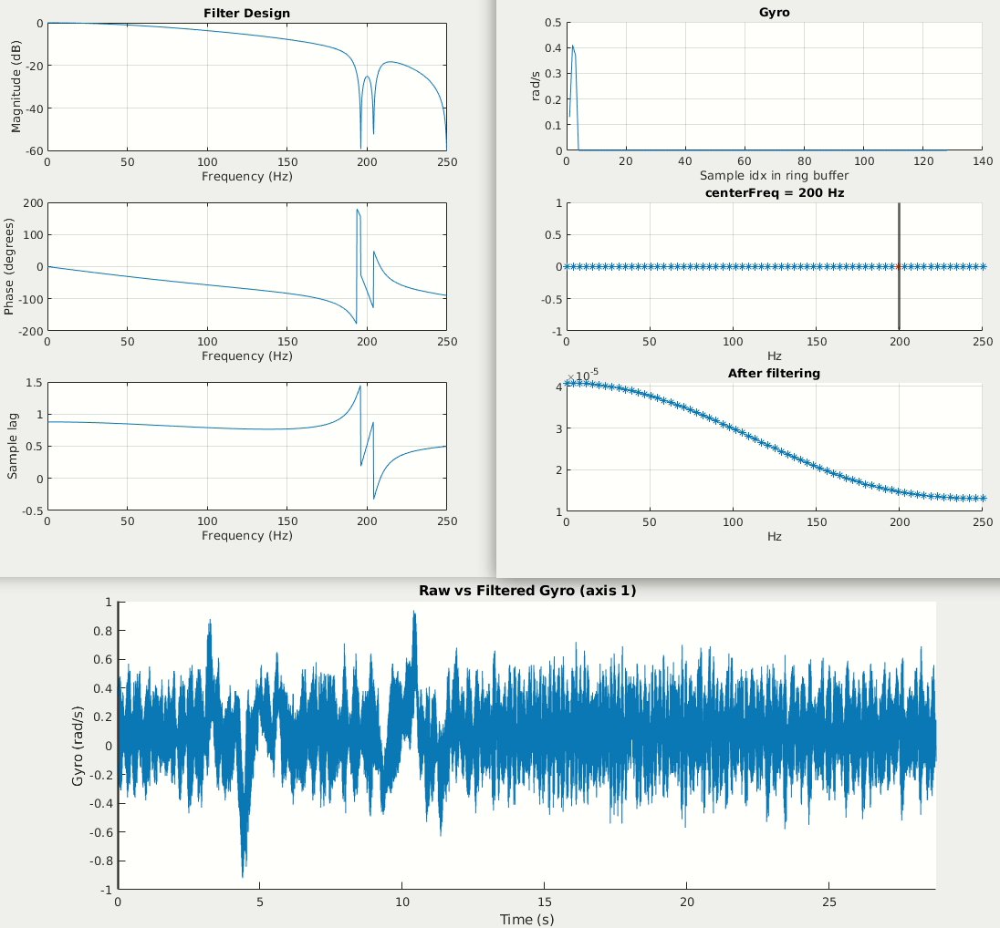
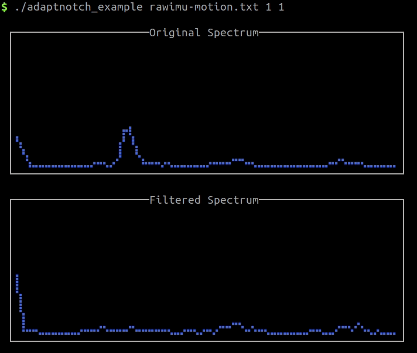

Adaptive Gyro Notch Filtering
=============================

Signal conditioning is an important part of a control strategy. In the context of multirotor control, the on-board gyro provides angular rate measurements which are directly used to drive the actual angular rate to the desired angular rate. In this setting, gyro noise is fed into the actuators, creating visible attitude fluctuations (i.e., "wiggles") even when the vehicle is meant to be hovering. Additionally, noisy gyro signals are directly related to hot motors (which can lead to motor failure, but is also an indication of performance). The majority of gyro noise comes from vibrations, caused by the spinning of the motors.

An easy way to reduce noise is with a low-pass filter. A commonly employed strategy in control is an [RC-type low-pass filter](https://en.wikipedia.org/wiki/Low-pass_filter), which is equivalent to a first-order IIR filter (e.g., see [here](http://www.olliw.eu/2016/digital-filters/#chapter22)). The tradeoff in filtering is always attenuation vs sample delay. A low cutoff frequency will more strongly attenuate high frequency noise at the cost of increased sample delay. Therefore, instead of designing a low-pass filter with a low cutoff frequency to attenuate high-frequency motor noise, a more targeted approach should be used.

This repo provides an implementation of an adaptive notch filter for gyro noise suppresion. It is largely inspired by [Betaflight](https://github.com/betaflight/betaflight), where the algorithm is meant to run on a resource-constrained microprocessor. While still efficient, this implementation enjoys the benefit of easy debugging and visualizations to help tune such an algorithm.

## Example Application

The [IMU data](data/) provided in this repo was collected at 500 Hz on a large hexarotor with 12" props. At hover, each motor spins around 4400 RPM. This corresponds to a frequency of roughly 73 Hz. Therefore, ignoring DC, we would expect the largest frequency component of gyro data to be at 73 Hz with harmonics at integer multiples. In the gif below, we can see this frequency component and its associated higher frequency harmonics. Note that on a smaller vehicle (like popular FPV drones that Betaflight is primarily used for), we would expect the motors to spin much faster.

After the dynamic notch algorithm converges to roughly 73 Hz (black vertical line), we can see that the post-filtering spectrum does not have this component and the time series gyro data is much cleaner.

### C++ Library

This repo also provides a C++ adaptive notch filtering library. An example application is provided that reads the provided IMU data and produces the same results as the MATLAB gif above. The excellent terminal plotting library [`plot`](https://github.com/fbbdev/plot) is included to produce plots (only in the example application) of the spectrum before and after filtering.

## Technical Description

Gyro samples are stored in a ring buffer, the size of which corresponds to the FFT length. In this example, a 128-length FFT is used. To analyze the spectrum in real-time, a Hann window is used to taper the values on the edges of the buffer (cf. [short-time Fourier transform](https://en.wikipedia.org/wiki/Short-time_Fourier_transform)). The peak finding algorithm to adaptively determine the center frequency of the notch filter searches within a user-defined range. The center frequency is estimated using a weighted mean and smoothing center frequency estimates through an alpha/RCLPF filter.

### Resources

- [Betaflight's `gyroanalyse.c`](https://github.com/betaflight/betaflight/blob/master/src/main/flight/gyroanalyse.c)
- Biquads: [OlliW](http://www.olliw.eu/2016/digital-filters)
- Biquads: [Nigel Redmon](https://www.earlevel.com/main/2012/11/26/biquad-c-source-code/)
- Betaflight filtering: [rav's Python code](https://github.com/rav-rav/betaflightCalc/tree/master/src)
- Other improvements: [Pawel S.'s "Matrix Filter" in iNav](https://quadmeup.com/emuflight-and-inav-matrix-filter/)
